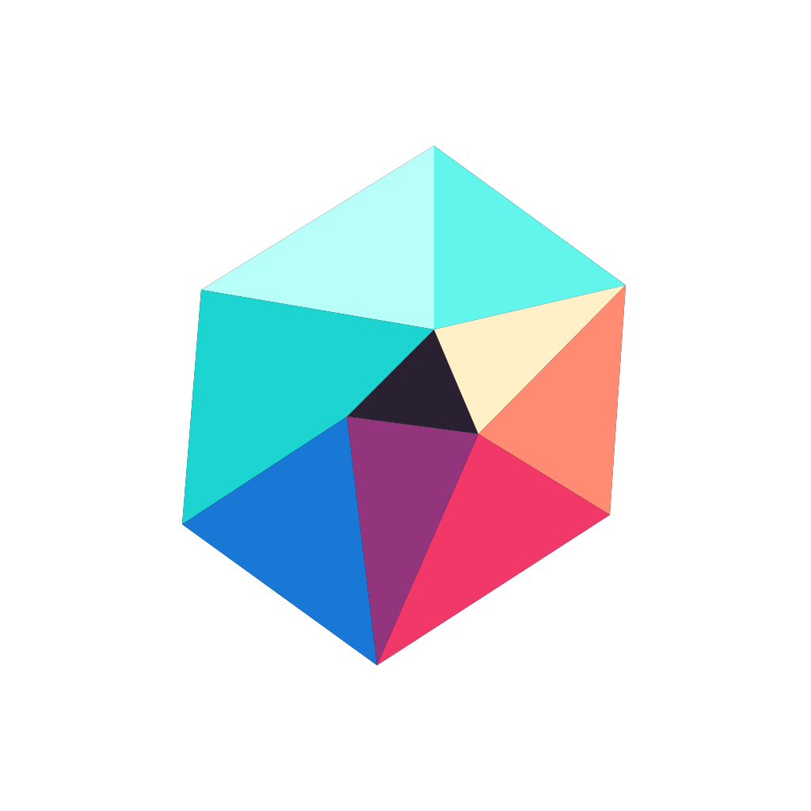
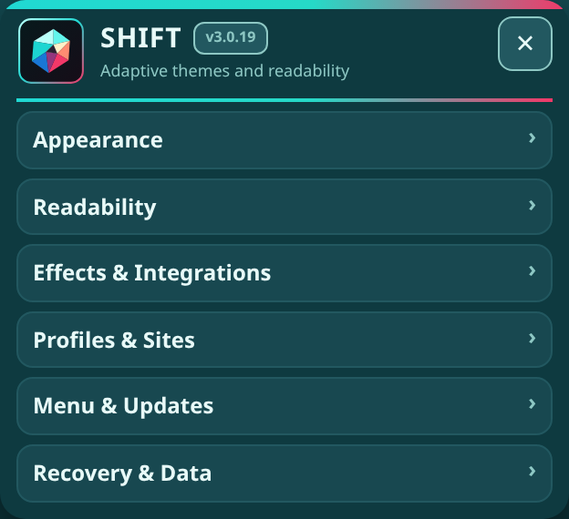
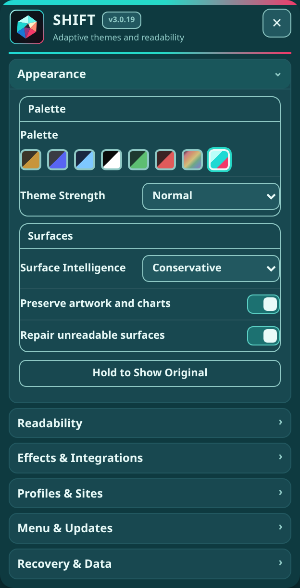
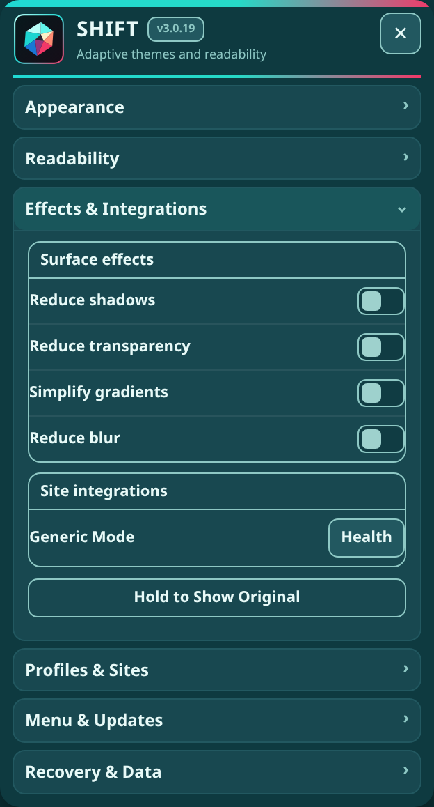
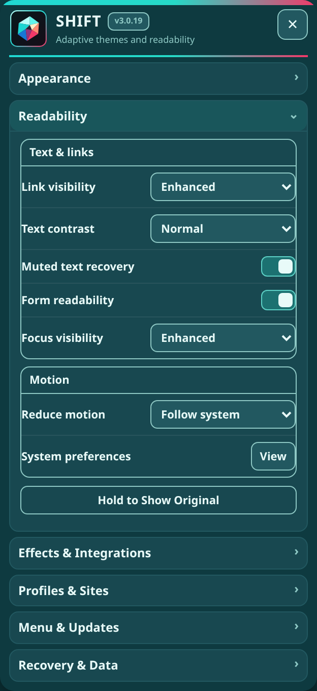
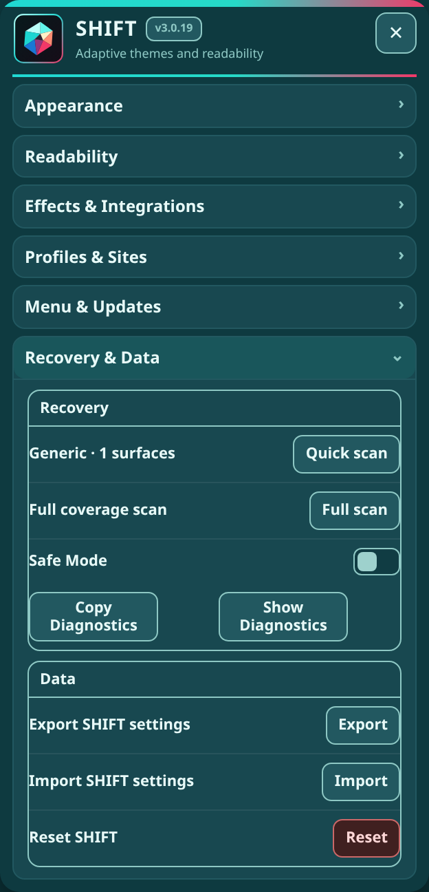

  

<h1 align="center">SHIFT</h1>

<strong>Semantic Page Themes and Readability</strong>

  A reversible appearance companion for applying accessible dark themes, repairing page surfaces, and improving readability across the web.

  
  
  
  
  
  

SHIFT 3.4 is being rebuilt on the Dropper 3.3.2 application baseline. Shared launcher, menu, update, diagnostics, theme-chrome, and coordination behavior comes from the bundled `exp-core`; SHIFT keeps only its dark-mode engine, settings, adapters, and site-specific behavior.

## Install

  
  
  

## What SHIFT Does

- Applies accessible semantic themes to page backgrounds, surfaces, text, links, forms, and controls.
- Preserves artwork and media while repairing bright or unreadable interface surfaces.
- Provides readability, contrast, focus, motion, shadow, transparency, gradient, and blur controls.
- Supports Original and Safe Mode paths that restore SHIFT's page changes.
- Maintains site-specific profiles and responds to navigation and dynamic page updates.
- Includes shared launcher placement, coordinated themes, update notices, and bounded, redacted diagnostics.

## Screenshots

<table>
  <tr><th width="20%">Overview</th><th width="20%">Appearance</th><th width="20%">Effects</th><th width="20%">Readability</th><th width="20%">Recovery</th></tr>
  <tr><td align="center"></td><td align="center"></td><td align="center"></td><td align="center"></td><td align="center"></td></tr>
</table>

## Diagnostics and product compatibility

Use **Show Diagnostics** / **Hide Diagnostics**, then **Copy Diagnostics** when troubleshooting. Reports include **Page**, **Technical**, **Console**, and **Plugin** sections, identify active ExtraPotions products and visible conflicts on the current page, and are never uploaded automatically.

## License

**Code:** [PolyForm Noncommercial License 1.0.0](LICENSE-CODE.md) 
**Artwork and documentation:** [CC BY-NC-SA 4.0](LICENSE-ASSETS.md)

See [NOTICE.md](NOTICE.md) for the split-license notice.

## Disclaimer

SHIFT is an independent project and is not affiliated with or endorsed by the websites it modifies.
