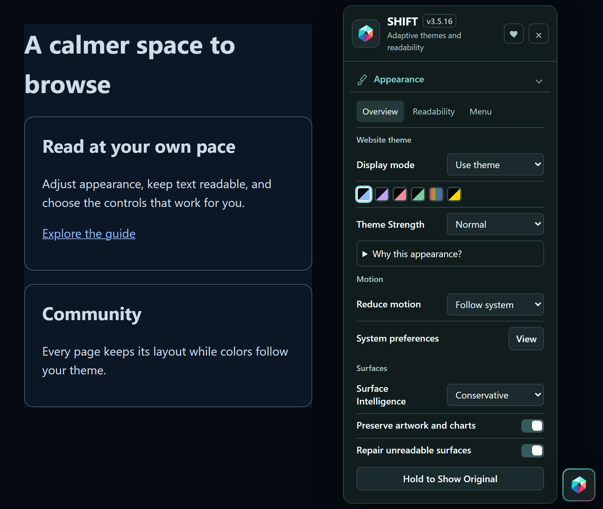
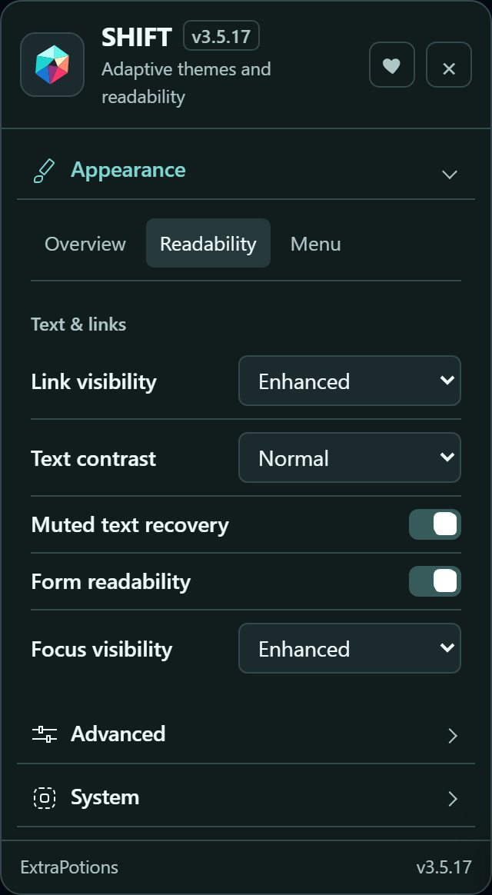

# SHIFT

**Site colors and readability, on your terms**

Keep a site’s original appearance or choose a color palette, then adjust reading comfort for the pages you use.

## Get started

1. Install a userscript manager such as [Violentmonkey](https://violentmonkey.github.io/get-it/) or [Tampermonkey](https://www.tampermonkey.net/).
2. [Install SHIFT](https://github.com/ExtraPotions/SHIFT/releases/latest/download/shift.user.js) and confirm in your userscript manager.
3. Refresh a page you want to use and open the product launcher.

Open Appearance and choose Original site, Follow system, or one of six website themes. Adjust Readability to your preference, then use Profiles & Sites for individual websites.

## What you can do

- **Simple System menu:** Status stays open with its reason and recovery action, plus recent activity. Support holds Copy Diagnostics and Report a Problem. Reset asks for a second tap inside the menu.

- **System status:** see Working, Waiting, Paused, or Needs attention, with a reason and a safe recovery action when available.
- **Theme status:** see whether the selected appearance is working, paused, or needs a safe retry in System. Original appearance is a valid choice.

- **Keep your settings:** saved preferences and existing settings exports remain supported as product naming is simplified.

- **Readable menus:** choose Standard, Large, or Extra Large from Appearance > Menu Preferences. The choice applies to ExtraPotions menus on this site.

- **Six website themes:** Midnight, Amethyst, Crimson, Verdant, Pride, and High contrast. Each includes coordinated colors for surfaces, text, links, and controls.
- **Distinct product menus:** the SHIFT menu keeps its signature appearance when you change a website theme or use other ExtraPotions products.
- **Saved element choices:** preserve a selected element’s original appearance on a site and clear those choices when needed.
- **Original by default:** no color choice is required. Return to Original to remove the applied page theme.
- **Visual palettes:** choose colors for page surfaces, text, links, and controls while preserving media.
- **Reading comfort:** adjust text, contrast, focus, and visual effects.
- **Site preferences:** use profiles and site-specific choices instead of treating every page the same.
- **Understand the result:** open “Why this appearance?” to see which settings control the current page and jump to their source.
- **Easy recovery:** pause changes or use recovery controls when a page needs its native appearance.

## See it in action

Screenshots show the product with sample content.

<table>
  <tr>
    <td width="50%" valign="top" align="center"> <strong>A chosen palette applied to sample page content</strong></td>
    <td width="50%" valign="top" align="center"> <strong>Text and reading controls</strong></td>
  </tr>
</table>

## Support

[Support development](https://ko-fi.com/expdare). Donations are optional. All features remain available without donating.

## License

**Code:** [PolyForm Noncommercial License 1.0.0](LICENSE-CODE.md) 
**Artwork and documentation:** [CC BY-NC-SA 4.0](LICENSE-ASSETS.md)

## About

SHIFT is an independent project and is not affiliated with or endorsed by the websites where it is used.

Smaller install files keep installation lightweight without removing features.

Known banking, healthcare, and email sites stay unchanged until you enable that exact site. Starter coverage is not universal; your site exclusions always take priority.
